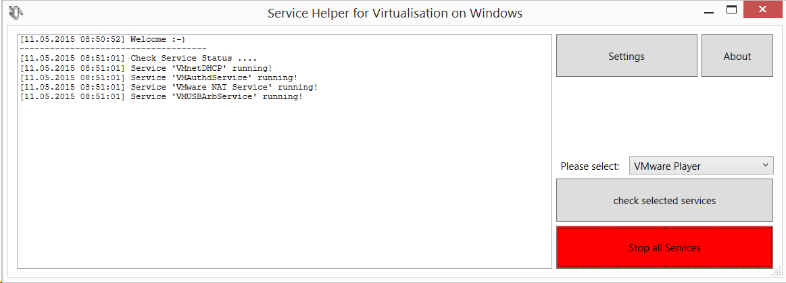

# vServiceHelper
## Service Helper for Virtualisation on Windows Hosts
Each Virtualisation Tool (eg. Virtualbox, VMware, ...) install some Windows Services. They run all the time and use System Resources. Sometimes they hinder each other. This little Tool is designed to help start/stop Windows Services who not needed.

### Requirements
 - Windows PC (tested on Windows 7 and Windows 8.1)
 - .Net Framework 4

### Download
Feel free to Clone or Fork this Repository get get the Source Code. Or take a look at the [Release Section](https://github.com/svenkuegler/vServiceHelper/releases) to download a compiled binary.

### Screenshot

### Credits
Icons by Icon8.com